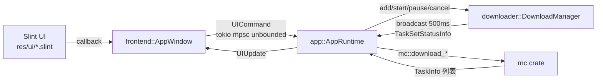

# CEMCL 项目总结（结构、规范、风格）

> 生成于冗余清理之后。仓库：constant-e/CEMCL，版本 0.3.0，Rust edition 2024。

## 1. 项目概览

CEMCL（CE Minecraft Launcher）是一个用 Rust + Slint 编写的 Minecraft 启动器。Cargo workspace 包含 6 个 crate：

| Crate | 类型 | 职责 |
|---|---|---|
| `app` | bin（`cemcl`） | 应用入口与运行时：管理器（账号/版本/Java）、事件循环、启动流程编排 |
| `frontend` | lib | Slint UI 封装：`AppWindow`、`UICommand`/`UIUpdate` 消息枚举、各页面数据模型转换 |
| `mc` | lib | Minecraft 核心逻辑：版本清单解析、启动参数生成、认证（OAuth/离线）、下载清单构建 |
| `downloader` | lib | 异步下载引擎：`DownloadTask` 状态机、`TaskSet` 任务集、`DownloadManager` 广播状态 |
| `java` | lib | Java 运行时探测与版本解析（`JavaInstallation`、`JavaVersion`） |
| `utils` | lib | 文件工具（目录列举、规则检查、下载辅助） |

依赖方向（单向）：`app` → `frontend` → `mc` → `downloader` → `utils`；`java` 独立，被 `app` 与 `frontend` 使用。

## 2. 架构与消息流

- **UI → App**：`UICommand` 枚举（`crates/frontend/src/app_window.rs`），经 `tokio::sync::mpsc::unbounded_channel` 发送，`AppRuntime::run` 中 `tokio::select!` 消费。
- **App → UI**：`UIUpdate` 枚举，经另一条 unbounded channel 发送，`AppWindow::handle` 用 `upgrade_in_event_loop` 更新 UI。
- **下载状态**：`DownloadManager` 内部 `tokio::sync::broadcast` 每 500ms 广播所有任务集状态（`TaskSetStatusInfo`），运行时订阅后转成 `UIUpdate::SetTaskSetList`。
- **对话框**：`AskDialog` 等由 Rust 侧 `slint::invoke_from_event_loop` 创建，弱引用存于 `Arc<Mutex<Option<Weak>>>`。

## 3. 配置与数据文件

程序启动时 `main.rs` 将工作目录切到 `~/.cemcl`，所有配置以 JSON 文件存放：

- `config.json` — 全局配置（通用/下载/游戏），`frontend::Config*` ↔ `app::Config*` ↔ `downloader::Config` 三层结构重复，靠手写 `From` 转换（结构性重复，保留）。
- `account.json` — 账号列表 + 当前索引。
- `versions.json` — MC 安装列表（CEMCL 格式），另存 `launcher_profiles.json` 兼容原版启动器。
- `java.json` — Java 安装列表 + 默认索引。

**镜像系统**：下载 URL 含 `{assets_source}`、`{fabric_source}`、`{game_source}`、`{libraries_source}`、`{forge_source}` 占位符，`DownloadManager::add_taskset` 按 `config.mirrors` 映射替换。

## 4. 命名与代码规范

- **私有静态辅助函数**：`i_` 前缀（如 `i_load`、`i_save_config`）。
- **转换函数**：`frontend_*` 前缀表示转成 UI 类型（如 `frontend_mc_config`）；`ui_*` 前缀表示构建 Slint 模型（如 `ui_acc_list`、`ui_java_list`）。
- **错误处理**：每个 crate 手写错误枚举 + `From` 转换 + `Display`（不用 thiserror）；错误日志统一 `error!("{e}")`。
- **注释**：中文 `///` 文档注释与英文混用；行内注释英文为主。
- **格式化**：标准 `cargo fmt` 风格；`use` 按 crate 分组。
- **异步**：tokio full features；下载任务内部用 mpsc channel 做命令控制（Pause/Resume/Cancel），`try_lock` 保护状态。
- **Slint**：入口 `res/ui/app-window.slint`，页面在 `res/ui/pages/`，对话框在 `res/ui/dialogs/`，公共组件在 `res/ui/components/`；`build.rs` 用 `slint_build::compile_with_config` + `with_bundled_translations("res/translation")`（fluent 风格，编译期打包翻译）；翻译更新脚本 `crates/frontend/update_translations.sh`（依赖 `slint-tr-extractor` 与 `msgmerge`）。

## 5. 已知怪癖（已修复，2026-09-09）

- ~~`utils::get_parent_dir` 手写字符串拼接~~ → 改用 `Path::parent()`。
- ~~`extract_lib` 使用相对路径 `temp{id}` 目录~~ → 改用 `std::env::temp_dir()` + UUID 唯一目录。
- ~~`tr_not_compatible()` 硬编码英文~~ → 通过 AppWindow 的 `out property not-compatible-text: @tr("not compatible")` 桥接翻译，Rust 侧读取后格式化。
- ~~`AccountType::Other` 序列化为空字符串~~ → 改为 `"Other"`。
- ~~`account.rs` 的 `save()` 中有空的 `error!("")` 日志~~ → 已删除。
- `open-edit-java-dialog` 回调已声明但未实现（对应 TODO，保留）。

## 6. 剩余 TODO（已核实均未实现）

1. `crates/mc/src/download/libraries.rs:78` — `// TODO: check hash`（natives 库已存在时校验哈希）
2. `crates/mc/src/download/libraries.rs:139` — `// TODO: check hash`（fabric 库已存在时校验哈希）
3. `crates/mc/src/download/assets.rs:34` — `// TODO: check hash`（资源已存在时校验哈希）
4. `crates/frontend/src/app_window.rs:248` — `// TODO: implement edit java dialog`（回调体为空；JavaPage 无 Edit 按钮，当前不可触发）
5. `crates/mc/src/account/account.rs:7` — `Other, // TODO: implement other account type`
6. `crates/frontend/res/ui/pages/accounts/account-item.slint:21` — `// TODO: User avatar`（当前用 icon.png 占位）
